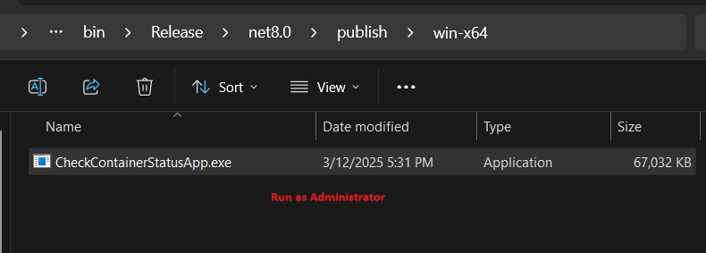
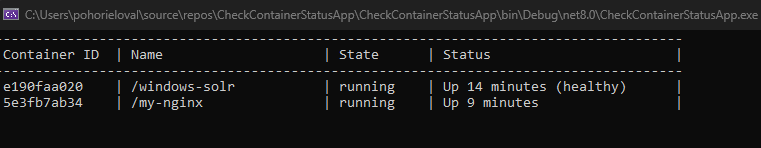

# Check Docker Containers Status Application
This repository contains a C# program utilizing the [Docker.DotNet NuGet package](https://www.nuget.org/packages/Docker.DotNet) to check the statuses of Docker containers.

## Documentation
Full documentation can be found at [Docker Offline - Check Containers Statuses](https://reedelsevier-my.sharepoint.com/:w:/r/personal/osypovay_science_regn_net/Documents/Documents/Elsevier/JPOC/Docker%20offline/Docker%20Offline.docx?d=wb2b34869ca2a4b4f83e389fbb32a95df&csf=1&web=1&e=OwyuY7&nav=eyJoIjoiMjEzMzM3OTIwNSJ9).

## Visual Demo
### Basic User Scenario
1. User recieves **.zip arhieve** with the application.
2. User extracts the arhieve.
3. User runs the application **as Administartor**.
4. Application checks the stauses of Docker containers and displays them in a table format.

**Note:** The application displays the current status of Docker containers when the .exe is launched (statuses are **not** updated automatically in real time). To view the latest status, the .exe must be restarted.

### Screenshots

